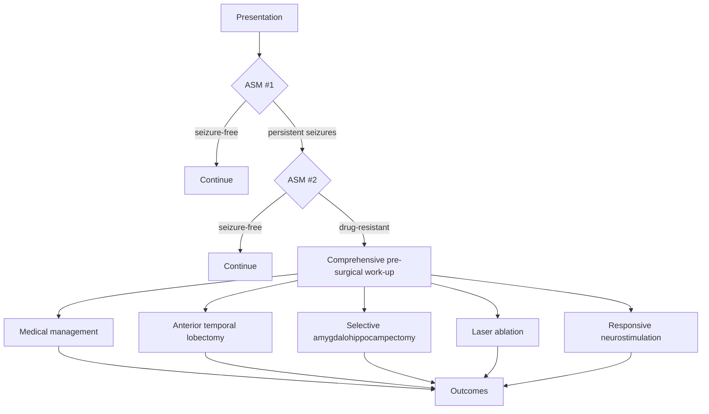

# Case study — epilepsy surgery

> *A precision-medicine decision-support model for drug-resistant focal epilepsy. The long-form version of the example introduced in [Getting started → Patient trajectory](../getting-started/patient-trajectory.md).*

## The clinical question

About a third of focal-epilepsy patients become drug-resistant despite trials of two appropriately chosen antiseizure medications. For these patients, surgical resection of the seizure focus is the only intervention with a realistic chance of seizure freedom. Surgery is also irreversible, costly, and carries a non-trivial risk of cognitive decline.

The decision is therefore: **for this specific patient, what is the joint probability of seizure freedom and unacceptable cognitive decline under each candidate strategy — anterior temporal lobectomy, selective amygdalohippocampectomy, laser interstitial thermal therapy (LITT), responsive neurostimulation (RNS), continued medical management?**

A clinician answering this question today does so by integrating MRI, scalp EEG, PET, MEG, neuropsychological testing, semiology, and treatment history in their head. The promise of AI is to do that integration explicitly, transparently, and at scale.

## What the trajectory looks like

Every arrow is a candidate object for the patient-trajectory model from [Getting started → Patient trajectory](../getting-started/patient-trajectory.md). The decision-support question lives at the bottom split.

## The data

A modern pre-surgical work-up produces a rich multi-modal data bundle per patient:

| Modality | Features extracted |
|---|---|
| Structural MRI | Hippocampal volume asymmetry, FLAIR lesion segmentation, cortical thickness, dysplasia detection (Meld-style) |
| Diffusion MRI | Tractography of language pathways, fractional anisotropy in temporal white matter |
| Scalp EEG | Interictal spike localisation, ictal onset zone, lateralisation |
| MEG | Equivalent current dipole source localisation, dipole clustering |
| PET / SPECT | Interictal hypometabolism / ictal hyperperfusion |
| iEEG (when performed) | Stereo-EEG onset zone, high-frequency oscillations |
| Neuropsychological testing | Verbal memory (WMS-IV), visual memory, language laterality (Wada / fMRI) |
| Semiology | Seizure-type, lateralising signs, auras |
| Medication history | Number of failed ASMs, polytherapy, current burden |
| Surgical-outcome registry | Historical outcomes per surgical strategy by suspected focus |

Engineering note: this is exactly the place where [NeuroStack → Data engineering](https://phindagijimana.github.io/neuro_stack/data-engineering/dag/) and the DAG-based pipeline practices it covers become essential. Each modality has its own preprocessing pipeline; a manifest binds them per patient per timepoint.

## The decision objects

We want, per patient, the joint posterior over:

- $\Pr(\text{Engel I at 2y} \mid X, do(A))$ — probability of seizure freedom under each candidate strategy $A$.
- $\Pr(\text{verbal-memory decline} \mid X, do(A))$ — probability of clinically meaningful decline.
- The MCD-corrected, calibrated joint utility.

The utility weight on seizure freedom vs. memory decline must be elicited from the patient — it is not a parameter of the model.

## Modelling pipeline

A working pipeline assembles four objects:

### 1. Concordance score (the seizure-focus localisation problem)

Each modality (MRI, EEG, PET, MEG, iEEG) produces a probabilistic estimate of the seizure-onset zone. The concordance model integrates them:

$$
\Pr(\text{focus in region } r \mid X) = f_\theta(X_{\text{MRI}}, X_{\text{EEG}}, X_{\text{PET}}, X_{\text{MEG}})
$$

Implementation:

- Per-modality lesion / focus probability map (Meld-style for cortical dysplasia, Hippunfold for hippocampal sclerosis).
- Multi-modal fusion via a Bayesian product of experts or a learned attention-based head.
- Output: probability map over an atlas plus a top-region prediction.

### 2. Outcome model per strategy

For each surgical strategy $A$, a survival model for time-to-seizure-recurrence and a binary model for clinically meaningful cognitive decline at 2 years, conditional on the patient features plus the concordance score:

$$
\hat{S}_A(t \mid X),\quad \hat{p}_A(\text{decline} \mid X)
$$

Estimated on a multi-institutional retrospective surgical cohort. Adjusted for confounding by indication using doubly-robust ML.

### 3. CATE between strategies

The contrast between strategies — anterior-temporal-lobectomy vs. LITT vs. continued medical management — at the patient level. Estimated with an R-learner or causal forest. The output for the clinician is the predicted absolute benefit of each strategy with confidence intervals.

### 4. Calibration and equity audit

- Calibration plots on a held-out site for each outcome.
- Per-subgroup calibration: sex, age at surgery, MRI-lesional vs. non-lesional, language-dominant hemisphere.
- Decision-curve analysis at clinically meaningful thresholds.

## What deployment looks like

A clinician-facing tool, integrated into the pre-surgical conference workflow:

- Patient summary on entry.
- Concordance map across modalities, with the model's lateralisation confidence.
- Per-strategy predicted seizure-freedom and cognitive-decline probabilities at 1, 2, and 5 years, with confidence intervals.
- Similar-patient retrieval — *here are five patients with comparable pre-surgical features who underwent strategy X; their trajectories were Y*.
- An override-and-explain UI: clinician picks a strategy, model logs the override and the clinician's free-text rationale.

The tool *does not* make the recommendation. It surfaces the comparison. The decision lives with the patient and the multidisciplinary team.

## Evaluation strategy

Three layers:

1. **Retrospective.** Predicted vs. observed outcomes on the held-out site, both globally and per subgroup. TRIPOD+AI reporting.
2. **Shadow mode.** Run the tool silently in clinical conferences for 6 months; record clinician decisions and model recommendations; compute concordance.
3. **Prospective.** A pragmatic stepped-wedge cluster randomised trial across surgical centres. Primary outcome: Engel I at 2 years post-surgery. Pre-registered.

## Why this is the canonical PrecisionStack example

The epilepsy-surgery decision exercises every chapter of the handbook:

| Chapter | Where it shows up |
|---|---|
| [Patient heterogeneity](../foundations/patient-heterogeneity.md) | Genetics, age, sex, imaging, comorbidities, treatment history |
| [Data modalities](../foundations/data-modalities.md) | EHR + multi-modal imaging + neuropsych + EEG |
| [Bias and confounding](../foundations/bias-and-confounding.md) | Confounding by indication (sicker patients get more aggressive surgery), selection bias (who reaches the comprehensive centre), label bias (who is in the surgical outcomes registry) |
| [Stratification](../tasks/stratification.md) | MTS vs. neocortical vs. dual pathology |
| [Treatment-response prediction](../tasks/treatment-response.md) | CATE over surgical strategies |
| [Risk prediction](../tasks/risk-prediction.md) | Cognitive-decline risk |
| [Clinical decision support](../tasks/clinical-decision-support.md) | Pre-surgical conference workflow integration |
| [Trial matching](../tasks/trial-matching.md) | LITT / RNS device trials |
| [Adaptive trials](../tasks/adaptive-trials.md) | Bayesian adaptive device trial in drug-resistant epilepsy |
| [Causal inference](../methods/causal-inference.md) | Doubly-robust CATE on the surgical registry |
| [Survival analysis](../methods/survival-analysis.md) | Time-to-recurrence model |
| [Evaluation](../methods/evaluation.md) | Calibration, decision-curve, equity audit |

## Replicating this work

A research engineer who wants to build this:

1. Assemble a multi-institutional surgical-outcome dataset under a data-use agreement. Pre-process each modality through a documented BIDS-derivatives pipeline.
2. Train the concordance model on the held-out lesional cases, using the surgical resection as ground truth for the focus.
3. Train the outcome models per strategy, adjusting for confounding by indication.
4. Train the CATE estimator and validate the predicted-vs-observed benefit curve on a held-out site.
5. Wireframe the clinician-facing surface and pilot in shadow mode.
6. Pre-register the stepped-wedge trial.

This is a multi-year project for a research group; the path from a published model to a deployed tool is the rest of the handbook.

## References

1. Engel J Jr. Surgical treatment of the epilepsies. *Lancet.* 2012;380:888–896.
2. Spencer DD, Spencer SS, et al. Outcomes after epilepsy surgery. *Brain.* 2015.
3. Stier AJ, et al. Multi-modal imaging in pre-surgical evaluation of focal epilepsy. *Epilepsia.* 2020.
4. Spitzer H, et al. The MELD project: Lesion detection in focal cortical dysplasia. *Brain.* 2022.
5. DeKraker J, et al. Hippunfold: a hippocampal-unfolding tool for high-resolution structural and functional imaging. *Nat Methods.* 2022.
6. Mathon B, et al. Predictors of long-term outcome of surgery in drug-resistant epilepsy. *Epilepsia.* 2017.

## Where to next

[Case study — oncology](oncology.md) for a tumour-immune precision-medicine example, or jump to [Regulatory](../regulatory/index.md) for what shipping a system like this entails.
