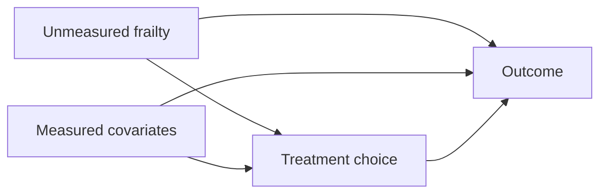

# Bias and confounding

> *Most clinical AI papers fail at deployment because of distortions that were present before any modelling decision was made. This chapter names them, locates them in the data-generating process, and gives the canonical mitigation for each.*

This chapter is the single highest-leverage chapter in the handbook for a working engineer. If you only read one chapter, read this one.

## A taxonomy

There are dozens of bias categories in the epidemiology literature. For precision-medicine AI, four matter most:

1. **Selection bias** — who is in the dataset.
2. **Confounding by indication** — why patients received the treatment they received.
3. **Measurement bias** — what is observed, and with what fidelity.
4. **Label bias** — what is recorded as the outcome.

Each one breaks a different precision-medicine task, and each one has a different fix.

## 1. Selection bias

Your dataset is not a sample of the disease; it is a sample of *patients who entered your data system with the disease*. That subset is shaped by:

- **Access to care.** Insurance, geography, language, race.
- **Health-seeking behaviour.** Patients who present early are systematically different from those who present late.
- **Site case mix.** A tertiary referral centre sees a harder case mix than a community hospital.
- **Survival.** Anyone in your historical dataset survived long enough to be measured.

Where it bites:

- **Stratification** finds subgroups defined by access patterns, not biology.
- **Risk prediction** under-counts the patients who died or left before being captured.
- **Trial matching** systematically excludes the populations who don't reach your screening pipeline.

Mitigations:

- **Document the cohort assembly.** Every inclusion criterion should be a date, a code, an action — not a "we identified patients with X".
- **Compare to external denominators.** Census, claims data, registries. If your "diabetic" prevalence is 8% and the state estimate is 11%, you have selection.
- **Use multi-site evaluation.** The clearest way to detect selection bias is to apply the model at a site you did not train at.
- **Inverse-probability-of-selection weighting** when an external sampling frame is available.

References: [Hernán & Robins, *Causal Inference: What If*](https://www.hsph.harvard.edu/miguel-hernan/causal-inference-book/) (the free reference text).

## 2. Confounding by indication

The single most damaging bias in observational precision-medicine work.

A patient receives treatment $A$ *because* of their state $S_t$. Sicker patients get more aggressive therapy. The treatment indicator is therefore correlated with the underlying state, and any naive comparison of outcomes by treatment compares two non-exchangeable groups.

Where it bites:

- **Treatment-response prediction** trained on observational data without adjustment routinely *inverts* the sign of the effect, because the sickest patients (highest treatment intensity) also have the worst outcomes.
- **Synthetic-control arms** drawn from clinically-treated historical patients suffer from the same problem.
- **Clinical decision support** that uses observational data without causal adjustment will perpetuate the historical treatment policy.

Mitigations (the rest of the handbook is largely about these):

- **Randomisation.** The gold standard. If the data is from an RCT, indication is broken by design.
- **Propensity-score adjustment.** Estimate $\Pr(A = 1 \mid X)$ and match, stratify, or weight on it. See [Methods → Causal inference](../methods/causal-inference.md).
- **Inverse-probability-of-treatment weighting (IPTW).** Re-weight the observational sample to mimic a randomised one.
- **Doubly robust estimators.** Combine an outcome model with a propensity model; you only need one to be right.
- **Instrumental variables.** When a quasi-randomisation exists in the data (e.g. preference-based variation across clinicians, calendar-time policy changes).
- **G-methods (G-computation, G-estimation, G-formula).** For time-varying confounding by indication, which is what you have whenever the treatment is updated over time based on intermediate outcomes.

The single most important practical move: **assume confounding by indication unless you can prove otherwise**.

## 3. Measurement bias

The data system measures different patients with different precision.

Examples:

- **Lab orders are not random.** A creatinine measured because the patient looked dehydrated is a different feature than a routine annual screen.
- **Imaging is acquired on indication.** "Patients with at least one MRI" is a biased subset of the disease population.
- **Genotyping is preferentially performed on patients with strong family history.**
- **Wear-time of a wearable** correlates with the patient's energy and mood.

Where it bites:

- **Risk prediction** uses "labs ordered" as a feature, which is really a clinician-suspicion proxy.
- **Stratification** finds clusters defined by who got measured.
- **Treatment-response** training assumes patients with complete measurement are exchangeable with those without.

Mitigations:

- **Missing not at random (MNAR) sensitivity analyses.** Tipping-point analyses, pattern-mixture models.
- **Inverse-probability-of-measurement weighting.**
- **Latent-variable / state-space models** that explicitly model the partial observation.
- **Restrict to a fully-measured cohort** at the cost of selection bias — pick your poison.

## 4. Label bias

Recorded outcomes ≠ true outcomes.

Examples:

- **Mortality.** Missed if the patient died at home, dropped out of follow-up, or moved.
- **Disease recurrence.** Detected only on the surveillance schedule a clinician ordered.
- **Adverse events.** Reported as a function of who is paying attention; passive systems massively under-report.
- **Diagnosis codes as outcomes.** "Recurrent stroke" depends on which clinic the patient was seen at and what they coded.

Where it bites:

- **Risk prediction** systematically underestimates outcomes that are under-ascertained.
- **Treatment-response** model error is correlated with treatment if surveillance differs by arm.
- **Survival analysis** with informative censoring is biased.

Mitigations:

- **Adjudicate a held-out subset.** Have a clinician (or panel) re-label a stratified random subset and report performance on adjudicated labels separately.
- **Joint models of outcome and ascertainment.** Account for the fact that censoring depends on covariates.
- **Use multiple label sources.** EHR + claims + state death registry + national death index. Each captures a different slice of the truth.

## A DAG-based diagnostic recipe

A useful exercise before any precision-medicine modelling project: draw the causal DAG of *the data-generating process*, not the model. Nodes are variables; arrows are causal influence. Then:

1. Identify the target estimand (CATE, prognostic risk, etc.).
2. Apply the back-door criterion to see which variables you need to adjust for.
3. Mark each required adjustment variable as **observed** or **unobserved**.
4. Each unobserved adjustment variable is a residual-confounding risk. Report it.

If the back-door from $A$ to $Y$ can be closed only by conditioning on $X$ (not $U$), the CATE is identifiable from observational data. If it requires $U$ and $U$ is unobserved, the CATE is *not* identifiable; the best you can do is a sensitivity analysis (E-value, Rosenbaum bounds).

## Bias × task — a quick-reference

| Task | Selection | Indication | Measurement | Label |
|---|---|---|---|---|
| Stratification | High | Low | High | Medium |
| Treatment-response | Medium | **Catastrophic** | Medium | Medium |
| Risk prediction | High | Low | High | High |
| Decision support | Inherited from above |
| Trial matching | High | Low | Medium | Low |
| Synthetic control | High | **Catastrophic** | Medium | High |
| Adaptive trial | Low (randomised) | Low (randomised) | Medium | Medium |

The "catastrophic" entries are the ones that have to be addressed before any modelling.

## Distribution shift, equity, and the deployment loop

Three additional sources of distortion that show up only after deployment:

- **Covariate shift.** New patient distribution differs from training. Monitor input-feature distributions with PSI / KL divergence.
- **Concept shift.** The relationship $\Pr(Y \mid X)$ has changed — new drug, new diagnostic threshold, new pandemic.
- **Subgroup disparity.** The model is well-calibrated on average but mis-calibrated for a subgroup. Report metrics stratified by sex, age band, race/ethnicity, site, and scanner — the [Regulatory](../regulatory/index.md) chapter expects nothing less.

A deployed model is part of a feedback loop. Its recommendations change what data is collected next, and that altered data trains the next model. This is the *policy* problem from [What AI can and cannot answer](../getting-started/what-ai-can-answer.md), and it can only be addressed with explicit off-policy evaluation and continual monitoring.

## Exercises

1. **Draw the DAG** for a precision-medicine project you are familiar with. Mark which adjustment variables are observed and which are not.
2. **For each of the four biases**, write the one mitigation step you would add to your current pipeline.
3. **Find a paper that estimates a treatment effect from observational data**. Identify which causal-inference assumption the authors are relying on (consistency, positivity, no-unmeasured-confounding) and whether they report a sensitivity analysis.

## References

1. Hernán MA, Robins JM. *Causal Inference: What If.* Boca Raton: Chapman & Hall/CRC, 2020. [Free PDF.](https://www.hsph.harvard.edu/miguel-hernan/causal-inference-book/)
2. Greenland S, Pearl J, Robins JM. Causal diagrams for epidemiologic research. *Epidemiology.* 1999;10(1):37–48.
3. VanderWeele TJ, Ding P. Sensitivity analysis in observational research: introducing the E-value. *Ann Intern Med.* 2017;167(4):268–274.
4. Sjölander A, Greenland S. Ignoring the matching variables in cohort studies. *Stat Med.* 2013;32(27):4696–4708.
5. Lipsky AM, Greenland S. Causal directed acyclic graphs. *JAMA.* 2022;327(11):1083–1084.

## Where to next

[Tasks](../tasks/index.md) — the seven workhorse precision-medicine tasks, each chapter starting from the clinical question and ending at the statistical formulation and evaluation criteria.
