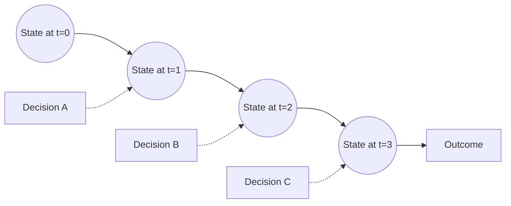

# The patient-as-a-trajectory model

> *Patients are not snapshots. They are trajectories through a high-dimensional state space, and clinical decisions are interventions on those trajectories.*

This is the single mental model that everything else in the handbook depends on. If you internalise it now, the rest of the chapters will fit together; if you don't, the methods will feel like a pile of disconnected techniques.

## The picture

Imagine each patient as a point in a high-dimensional space whose axes are everything that could affect their future health — genetics, imaging, labs, comorbidities, medications, environment, behaviour. Time turns each patient into a **path** through that space.

- **States** $S_t$ — everything observable about the patient at time $t$.
- **Decisions** $A_t$ — interventions: a prescription, a procedure, a watchful-waiting decision, a referral.
- **Transitions** $P(S_{t+1} \mid S_t, A_t)$ — how the state evolves given the current state and the decision.
- **Outcomes** $Y$ — the endpoints we ultimately care about: seizure freedom, overall survival, hospital-free days, patient-reported quality of life.

Every chapter of this handbook is doing something to this picture.

| Task | What it does to the picture |
|---|---|
| **Stratification** | Partitions the state space into regions that behave differently. |
| **Risk prediction** | Estimates $\Pr(Y \mid S_t)$ — where this trajectory is heading if nothing changes. |
| **Treatment-response prediction** | Estimates $\Pr(Y \mid S_t, A_t = a)$ for each candidate decision $a$. |
| **Clinical decision support** | Surfaces the comparison across candidate $a$'s to the clinician at the point of decision. |
| **Trial matching** | Identifies trajectories whose current state $S_t$ falls inside a trial's eligibility region. |
| **Synthetic control** | Borrows historical trajectories whose state was similar at the analogous time, to estimate the counterfactual outcome under $A_t = 0$. |
| **Adaptive trials** | Update the transition / outcome model as new trajectories arrive, and re-allocate enrolment toward more informative or more promising decisions. |

## Why this matters

Three things drop out of taking the trajectory picture seriously, and ignoring them is the source of most published-but-unreplicable AI-for-medicine results:

### 1. Temporal alignment

A naive model joins all of a patient's data into one row, runs a classifier, and reports an AUC. The trajectory picture forces you to ask: *at what time $t$ in the patient's path was each feature observed?* If a "predictor" was actually measured *after* the outcome, you've leaked information. Common leaks:

- Discharge diagnosis codes used to "predict" admission acuity.
- Imaging acquired after a treatment decision used to predict that decision.
- Labs ordered *because* the clinician suspected the outcome.

Every feature should be timestamped, and the model should only see features observable at or before the prediction time $t^\*$.

### 2. Treatment is part of the state evolution

A classifier trained on retrospective data has, baked into its labels, the effects of every treatment those patients received. If you predict "death within 30 days" on heart-failure patients and the model says *low risk*, what it usually means is *low risk if the patient continues to receive the same care they got in the training cohort*. Deploying the model to triage patients *away* from that care can make the prediction wrong, because the prediction was a counterfactual under continued treatment, not under the new policy.

This is the difference between a **prognostic model** (what will happen on the current trajectory?) and a **predictive model** (what will happen on this trajectory if I change $A_t$?). They are different objects and require different estimation strategies. See [Tasks → Treatment-response prediction](../tasks/treatment-response.md).

### 3. The outcome is itself a trajectory

A single endpoint at a single time hides most of the clinically interesting variation. Two patients with the same six-month seizure count can have wildly different trajectories — one tapering off, one accelerating. Modern precision-medicine analyses model the **time course** of the outcome (longitudinal mixed models, joint models, neural ODEs, state-space models) rather than collapsing it to one number. See [Methods → Survival analysis](../methods/survival-analysis.md) and [Methods → Unsupervised subtyping](../methods/unsupervised-subtyping.md).

## The state space is what you measure

The trajectory lives in a state space whose axes are exactly the variables in your data. If your data is just demographics and a single ICD-10 code, your state space has six axes and the trajectory is impoverished. If your data is genomics + serial imaging + EHR + a wearable, your state space is rich.

This is why [Foundations → Data modalities](../foundations/data-modalities.md) matters and why so much of clinical-AI engineering is data engineering. The model can only see the axes you give it; the heterogeneity you can recover is bounded by the axes you measured.

## Where the trajectory picture breaks

The picture is a useful simplification. Two places it lies:

1. **The state is not fully observed.** What you have is a noisy projection of the true state through whatever modalities you measured. Hidden Markov / state-space / particle-filter approaches make the gap between observed and true state explicit.
2. **Decisions are not exogenous.** In retrospective data, the decision $A_t$ at every step is correlated with $S_t$ — sicker patients get more aggressive treatment. This is **confounding by indication**, the biggest single source of bias in observational treatment-effect estimates. See [Foundations → Bias and confounding](../foundations/bias-and-confounding.md) and [Methods → Causal inference](../methods/causal-inference.md).

You will see both of these explicitly modelled in the more advanced chapters.

## A worked sketch — epilepsy

Take a 22-year-old with drug-resistant focal epilepsy:

- **$S_0$ (presentation)** — demographics, semiology, baseline EEG, MRI.
- **$A_0$** — start ASM #1.
- **$S_1$** — 3-month follow-up: seizure count, side-effect profile, ASM levels.
- **$A_1$** — switch to ASM #2.
- **$S_2$** — 6 months later: continued seizures, neuropsych deficits emerging.
- **$A_2$** — referral to comprehensive epilepsy centre for surgical work-up. MEG, PET, intracranial EEG.
- **$S_3$** — full pre-surgical evaluation complete; suspected mesial temporal sclerosis on left.
- **$A_3$** — anterior temporal lobectomy.
- **$Y$** — Engel class I at 2 years (seizure-free), with mild verbal-memory decline.

Now ask precision-medicine questions of this trajectory:

- **Stratification:** Which subgroup of focal-epilepsy patients does this patient belong to — left-mesial-temporal? Which subgroup historically benefits most from surgery? See [Tasks → Stratification](../tasks/stratification.md).
- **Risk prediction:** What is the probability of cognitive decline after surgery, given $S_3$? See [Tasks → Risk prediction](../tasks/risk-prediction.md).
- **Treatment-response prediction:** What is the probability of seizure freedom at 2 years under surgery vs. continued medical management vs. responsive neurostimulation, all conditional on $S_3$? See [Tasks → Treatment-response prediction](../tasks/treatment-response.md).
- **Trial matching:** Does $S_3$ make this patient eligible for an open trial of laser interstitial thermal therapy? See [Tasks → Trial matching](../tasks/trial-matching.md).
- **Synthetic control:** If this patient enrols in a single-arm trial of a novel device, what is the appropriate matched historical control? See [Tasks → Synthetic control arms](../tasks/synthetic-controls.md).

We come back to this example in detail in [Case study — epilepsy surgery](../case-studies/epilepsy.md).

## Where to next

Read [What AI can and cannot answer](what-ai-can-answer.md) to ground what kinds of questions the trajectory picture makes tractable, and which ones it does not.
