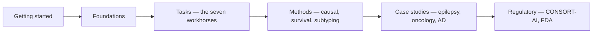

# PrecisionStack

> *The open precision-medicine and clinical-trials handbook — from "what is precision medicine?" to running an adaptive Bayesian trial.*

PrecisionStack is the clinical-decision companion to [NeuroStack](https://github.com/phindagijimana/neuro_stack). NeuroStack covers how to turn raw biomedical signal into evidence. PrecisionStack covers how to turn that evidence into **individualised decisions** and **trials that learn**.

## Who this is for

- **A clinician** trying to understand what an "AI risk score" really means before relying on it for a patient.
- **A graduate student** building their first treatment-response model and trying to avoid the classic evaluation traps.
- **A research engineer** standing up a cohort-discovery pipeline that has to survive an external validation.
- **A trial statistician** considering a synthetic-control arm or an adaptive design and wanting to know what they're actually signing up for.
- **A regulatory affairs reviewer** mapping a new clinical-decision-support product to CONSORT-AI and FDA SaMD criteria.

The handbook starts at the *what-is-this* level and ends at the *how-do-I-defend-this-in-an-FDA-pre-submission* level. The same chapter sequence works for all readers — but each chapter starts in plain language and ends with the precise vocabulary and citations a research engineer or biostatistician will want.

## The mental model

Precision medicine is the question:

> *What is most likely to work for **this** patient, **now**?*

That is a different question from the one classical clinical research answers ("what works on average for patients like this?"), and the change of question changes everything downstream:

| Classical clinical research | Precision medicine |
|---|---|
| Average treatment effect across a population | Conditional average treatment effect (CATE) for a single patient |
| Outcome at study endpoint | Trajectory across time and treatments |
| Eligibility = clinical phenotype | Eligibility = phenotype + genotype + imaging + behaviour |
| Fixed protocol | Protocol that adapts as evidence accumulates |
| Same control arm for everyone | Patient-matched / synthetic control |
| Statistical significance | Calibration and decision utility for *this* patient |

PrecisionStack is organised around making each of those shifts explicit and operational.

## How the handbook is organised

- **[Getting started](getting-started/index.md)** — the plain-language layer. What precision medicine is, the patient-as-a-trajectory mental model, the questions AI can and cannot answer.
- **[Foundations](foundations/index.md)** — what makes patients different (genetics, age, sex, disease subtype, imaging, labs, meds, lifestyle, environment, comorbidities, immune profile, treatment history), the modalities that capture those differences, and the systematic biases each modality smuggles in.
- **[Tasks](tasks/index.md)** — the seven workhorse problem types: stratification, treatment-response prediction, risk prediction, clinical decision support, trial matching, synthetic-control arms, adaptive trials. Each chapter gives a clinician-readable definition, the statistical formulation, the canonical methods, the evaluation rubric, and a working example.
- **[Methods](methods/index.md)** — the technical core: causal inference for treatment-effect estimation, survival analysis for time-to-event outcomes, unsupervised subtyping for discovering disease mechanisms, and the evaluation/calibration machinery for individualised predictions.
- **[Case studies](case-studies/index.md)** — three worked examples: an epilepsy-surgery decision-support model (the long-form version of the example in *Getting started*), an immunotherapy-response model in oncology, and a progression-subtype model in Alzheimer's.
- **[Regulatory](regulatory/index.md)** — CONSORT-AI, SPIRIT-AI, DECIDE-AI, the FDA pathways for AI/ML-enabled clinical decision support, and the documentation an auditor will ask for.

## Reading paths

- **Clinician-curious, 90 minutes.** [Getting started](getting-started/index.md) → [Tasks index](tasks/index.md) → [Epilepsy case study](case-studies/epilepsy.md).
- **Graduate student, one semester.** Read every chapter in order, do every exercise.
- **Research engineer, sprint week.** [Foundations → Bias and confounding](foundations/bias-and-confounding.md) → [Methods → Causal inference](methods/causal-inference.md) → [Tasks → Treatment-response prediction](tasks/treatment-response.md) → [Methods → Evaluation](methods/evaluation.md) → [Regulatory → CONSORT-AI](regulatory/consort-spirit.md).
- **Trial statistician.** [Tasks → Synthetic control arms](tasks/synthetic-controls.md) and [Tasks → Adaptive clinical trials](tasks/adaptive-trials.md), then [Regulatory](regulatory/index.md).

## A note on cross-references

Where a topic is covered better in NeuroStack — e.g., the imaging modality itself, the data-engineering DAG that produces the features, evaluation traps specific to imaging — we link out rather than duplicate. Where the precision-medicine framing extends or overrides what NeuroStack says, we say so explicitly.

Welcome.
