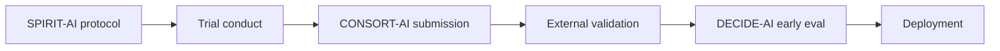

# CONSORT-AI and SPIRIT-AI

> *The modern reporting standards for randomised trials of AI interventions and the protocols that precede them.*

## CONSORT-AI

[CONSORT-AI](https://www.nature.com/articles/s41591-020-1034-x) (Liu et al., 2020) is the AI extension of the CONSORT 2010 statement. It adds 14 AI-specific items to the trial-reporting checklist.

The items that catch the most authors:

- **Algorithm version.** Pin the exact version that was tested. A model that has been retrained between protocol and submission is a different model.
- **Intended use** — including the patient population, the intended user, the intended setting, and what the algorithm explicitly does *not* do.
- **Input data** — modality, format, pre-processing, hardware requirements at deployment.
- **Output** — the form of the output (probability, classification, recommendation), and how it is delivered to the user.
- **Human-AI interaction** — when in the workflow the AI is consulted, whether the human can override, what happens to overrides.
- **Performance error analysis** — pre-specified subgroup analyses, distribution shift handling, abstention behaviour.
- **Code and data availability** — the trial team's commitment to reproducibility.

A trial that reports against the full CONSORT-AI checklist is interpretable; a trial that doesn't is hard to assess and harder to replicate.

## SPIRIT-AI

[SPIRIT-AI](https://www.nature.com/articles/s41591-020-1037-7) (Cruz Rivera et al., 2020) is the equivalent extension for trial *protocols* — the pre-registered analysis plan that the trial is committed to before patients are enrolled.

The same 14 items, raised at the protocol stage: by the time you are unblinding the trial, the protocol has already committed to the algorithm version, the intended use, the input format, the human-AI interaction, the subgroup analyses, and the deployment plan. Post-hoc editing of any of these is a deviation.

## How they fit together

SPIRIT-AI is what you commit to up front. CONSORT-AI is what you report afterwards. [DECIDE-AI](decide-ai.md) is what you report in the early-clinical-evaluation phase between trial and full deployment. The PCCP plan (FDA) governs post-deployment iteration.

## Common deviations and how to avoid them

- **Algorithm version drift.** Pin everything: code commit SHA, container digest, model weights hash, dependency lockfile. Re-train ≠ same model.
- **Intended-use creep.** A trial in adult inpatients does not establish use in paediatrics.
- **Subgroup analyses post-hoc.** Pre-specify them in SPIRIT-AI; report them all in CONSORT-AI, including the ones that disappointed.
- **Skipping the human-AI interaction description.** A model that recommends antibiotic adjustment without specifying who clicks accept is not deployable.

## The minimal SPIRIT-AI commitments

Before a trial enrols its first patient, the protocol should commit to:

- [ ] Algorithm version + how it will be updated (if at all) during the trial.
- [ ] Intended use, intended users, intended setting.
- [ ] Input modality + handling of missing inputs.
- [ ] Output form + delivery channel (EHR, standalone, mobile).
- [ ] Human-AI interaction mode + override behaviour.
- [ ] Pre-specified subgroup analyses.
- [ ] Distribution-shift handling.
- [ ] Adverse-event capture mechanism.
- [ ] Code + data availability commitment.
- [ ] Post-trial deployment plan.

## References

1. Liu X, Cruz Rivera S, et al. Reporting guidelines for clinical trial reports for interventions involving AI: CONSORT-AI extension. *Nat Med.* 2020;26(9):1364–1374.
2. Cruz Rivera S, Liu X, et al. Guidelines for clinical trial protocols for interventions involving AI: SPIRIT-AI extension. *Nat Med.* 2020;26(9):1351–1363.

## Where to next

[DECIDE-AI](decide-ai.md) — the early-stage evaluation reporting standard.
