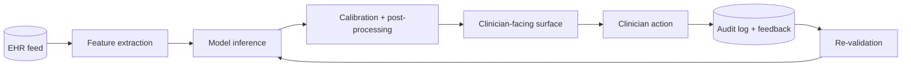

# D. Clinical decision support

> *Clinical decision support (CDS) is the practice of turning a prediction or a treatment-effect estimate into something a clinician can act on at the point of care, in a way that improves outcomes and does not erode trust.* This chapter is about everything that happens after the model is built.

## The premise

A good CDS system is the answer to *why does anyone in the clinic care about the model?* Three properties:

1. **It is consumed at the right time.** The output is in the clinician's workflow at the moment of the decision, not in a dashboard nobody opens.
2. **It is consumed by the right person.** The audience is the decision-maker; the prediction is framed in the vocabulary of that decision-maker.
3. **It changes the decision in a useful way.** If the recommendation matches what the clinician was going to do anyway, the system has added cost without benefit.

A model with strong AUROC and no thoughtful CDS layer is a research artifact, not a clinical tool. A model with weaker AUROC but a thoughtful CDS layer can change practice.

## The five categories

In practice, CDS systems take five forms.

| Category | Description | Example |
|---|---|---|
| **Diagnostic suggestion** | Surfaces differential-diagnosis ranking | Radiology assist that highlights suspicious lung nodules |
| **Recommended test** | Suggests the next workup step | Pre-test probability calculator for PE → CT vs D-dimer |
| **Treatment option ranking** | Ranks candidate therapies by predicted benefit | First-line antidepressant selector |
| **Risk score with action** | Posts a risk number with a paired action | Sepsis alert → bundle; readmission risk → care-management referral |
| **Similar-patient retrieval** | Shows a panel of past similar patients | "Patients like this one with mesial TLE who had ATL → seizure-free rate 70%" |

A single CDS system is often more than one of these — diagnostic + treatment + risk all in one — but it should be intentionally so.

## The architectural anatomy



Each box hides a research question:

- **Feature extraction.** Map raw EHR / imaging / notes into the model's feature representation. NLP for free text, harmonisation for imaging. See [Foundations → Data modalities](../foundations/data-modalities.md).
- **Model inference.** The model itself. Latency budget is typically < 1 s for synchronous CDS, larger for batch.
- **Calibration + post-processing.** Threshold selection, uncertainty quantification, conformal prediction sets, abstention.
- **Clinician-facing surface.** Wording, ranking, visualisation, *what is omitted*. The single highest-leverage design decision.
- **Audit log.** Every prediction, every action taken or not taken, with timestamp, model version, user.
- **Re-validation.** Periodic comparison of predicted vs. observed; drift detection; performance per subgroup over time.

## Surface design — what the clinician sees

This is where CDS systems most often fail. A few hard-won principles.

- **Frame the output as a probability or a risk decile, not a binary "alert".** Binary alerts produce alert fatigue and ignore the calibration the modelling team worked so hard for.
- **Show absolute risk, not relative.** "30% chance of readmission" beats "2× higher risk than average".
- **Show the uncertainty.** A point estimate without a confidence interval is over-confident.
- **Show one or two top drivers, not all of them.** Use [SHAP / LIME explanations] only as a discussion starter, not as a causal claim.
- **Pair the prediction with a candidate action.** "Risk 30%; consider care-management referral" beats "Risk 30%" alone.
- **Allow override and capture the reason.** Override data is the feedback the model needs.

## Workflow integration

The hardest engineering problem in CDS is not the model — it is the FHIR/HL7 plumbing, the SMART-on-FHIR launch context, the Epic/Cerner-specific quirks, and the IT-security review of every API.

A working SMART-on-FHIR CDS Hooks pattern:

```text
order-select (oncology referral) →
    EHR → Hook payload (patient, encounter, draft order) →
    CDS service → SMART card (recommendation + actions) →
    EHR injects card into clinician's order-entry view →
    Clinician accepts, modifies, or dismisses →
    Action posted back via FHIR write
```

Reference: [HL7 CDS Hooks 1.1 spec](https://cds-hooks.hl7.org/2.0/).

## The off-policy evaluation problem

Once deployed, the CDS system is part of the policy and changes future training distributions. Evaluating a *new* model version means asking "what would have happened under the new policy?" — an inherently counterfactual question.

Standard tools:

- **Inverse-propensity weighted (IPW) evaluation** — re-weight historical actions by the new policy's probability ratio.
- **Doubly-robust off-policy evaluation** — combine an IPW estimate with a fitted reward model.
- **Direct method** — fit a reward model and evaluate under the new policy.
- **Continual A/B testing in shadow mode** — log the new model's recommendation without showing it, compare to actually-taken actions.

A robust CDS deployment uses *all* of these and reports each one transparently.

References: [Dudik et al. 2014](https://www.jmlr.org/papers/v15/dudik14a.html); [Jiang & Li 2016](https://arxiv.org/abs/1511.03722); [Athey & Wager 2021](https://onlinelibrary.wiley.com/doi/10.3982/ECTA15732).

## Trust, alert fatigue, and graceful degradation

Three failure modes specific to CDS:

- **Alert fatigue.** Average sepsis-alert systems fire dozens of times per shift; clinicians learn to dismiss. The threshold matters more than the model.
- **Automation bias.** Clinicians under-investigate when the model agrees with them and over-defer when the model disagrees.
- **Trust collapse.** A single visible model failure can erase years of accumulated confidence. Design for graceful degradation: abstention, confidence intervals, "I don't know" outputs.

The most successful CDS deployments — diabetic retinopathy screening, sepsis bundle adherence, ICU early-warning systems — earned trust slowly through transparent reporting and human-paired workflow. The corollary: the *first* deployment of any new model should be in shadow mode.

## Regulatory framing

Most CDS systems that drive treatment decisions are Software-as-a-Medical-Device (SaMD) under IMDRF / FDA framing. The 21st Century Cures Act carves out a CDS exemption when the clinician can *independently review the basis* of the recommendation — but the carve-out is narrower than it looks, and a black-box model usually does not qualify.

The thresholds for FDA clearance, the documentation an auditor will ask for, and the PCCP (predetermined change-control plan) framework are covered in [Regulatory → FDA pathways](../regulatory/fda-pathways.md).

## A worked example — sepsis early warning

1. **Population.** Adult inpatients at four hospitals; exclusion: comfort-care.
2. **Model.** Gradient-boosted classifier on rolling-window vitals + labs + diagnoses; output every hour.
3. **Calibration.** Held-out temporal validation; per-site calibration plots.
4. **Threshold.** Chosen on the decision-curve sweet spot for net benefit at a threshold corresponding to 60% sensitivity / 80% specificity.
5. **Workflow.** Above-threshold patients trigger a bedside-nurse notification + automated sepsis-bundle order set.
6. **Audit.** Every alert, every bundle action, every override logged.
7. **Evaluation.** Shadow mode for 90 days; then randomised rollout by ward; primary outcome = 30-day mortality; secondary = bundle adherence; pre-specified subgroup analyses by race.

Failures to avoid:

- Skipping shadow mode.
- Choosing the threshold by AUROC sensitivity / specificity alone, without decision-curve analysis.
- Not auditing override reasons.
- Not pre-specifying the subgroup analyses.

## Exercises

1. **Wireframe a CDS surface** for your favourite risk model. What is the absolute risk, the action, the override path, and the uncertainty representation?
2. **Find a published CDS deployment** (sepsis, readmission, AKI). Identify the off-policy evaluation it did or did not perform.
3. **Write the CDS-Hooks payload schema** for an oncology-referral assist tool: which features does it consume, what does it return?

## References

1. Sittig DF, Wright A, Osheroff JA, et al. Grand challenges in clinical decision support. *J Biomed Inform.* 2008;41(2):387–392.
2. Sutton RT, et al. An overview of clinical decision support systems. *NPJ Digit Med.* 2020;3:17.
3. Wong A, et al. External validation of a widely implemented proprietary sepsis prediction model in hospitalized patients. *JAMA Intern Med.* 2021;181(8):1065–1070.
4. Vasey B, et al. Reporting guideline for the early-stage clinical evaluation of decision-support systems driven by artificial intelligence: DECIDE-AI. *BMJ.* 2022;377:e070904.
5. Sendak MP, et al. Real-world integration of a sepsis deep learning technology into routine clinical care. *JMIR Med Inform.* 2020;8(7):e15182.

## Where to next

[E. Trial matching](trial-matching.md) — the same pipeline pattern, but for a different decision: trial enrolment.
