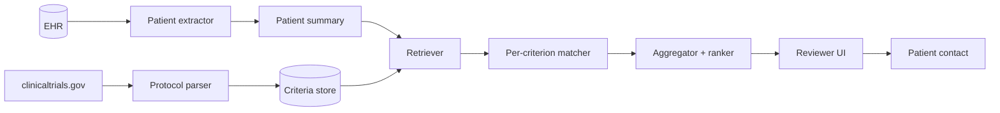

# E. Trial matching

> *Clinical trials need eligible patients. Eligibility criteria can be brutally specific. AI — especially NLP over the EHR — can scan millions of records and surface the patients who might qualify, helping them access experimental therapies and helping the trial finish on time.*

## The problem

A typical phase-II/III protocol has 30–80 eligibility criteria — a mix of structured (age, lab thresholds) and unstructured (no prior anti-PD-1 therapy, no untreated brain metastases, no concurrent autoimmune disease). Manual screening through the EHR is slow, error-prone, and biased toward patients already on the trial team's radar.

Two failure modes of manual screening that an AI system can mitigate:

1. **Under-enrolment.** Trials that miss accrual targets close without answering the scientific question.
2. **Selection bias.** Manual screening tends to favour patients already known to the screening team. Underserved populations get under-represented.

A well-built trial-matching system should *expand* the candidate pool, not just speed it up.

## The estimation target

Trial matching is a classification problem at the patient × trial level:

$$
M(x, t) = \mathbb{1}\{x \in \mathcal{E}_t\}
$$

where $\mathcal{E}_t$ is the eligibility region of trial $t$. The interesting structure is that $\mathcal{E}_t$ is a *conjunction* of many predicates, each of which can be:

- **Structured + sharp** — `age ≥ 18`, `GFR ≥ 60`.
- **Structured + fuzzy** — "Karnofsky ≥ 70" (KPS may not be coded).
- **Unstructured + sharp** — "ECOG 0–1" (typically only in clinic notes).
- **Unstructured + fuzzy** — "no clinically significant cardiac disease", "no concurrent immunosuppressive therapy".

A successful matching pipeline composes a structured-data engine for the sharp criteria and a NLP / LLM engine for the unstructured ones.

## Method families

### Rule-based + structured EHR

The classical baseline. Eligibility criteria are encoded as Boolean rules over an OMOP / FHIR view of the EHR. Strengths: transparent, auditable, easy to update. Weaknesses: cannot handle unstructured criteria; cannot handle synonyms; brittle to coding conventions.

### NLP-based criteria parsing

Convert the trial protocol's free-text criteria into machine-checkable predicates:

- **Concept extraction.** Map "metastatic" → SNOMED concept; "EGFR L858R" → HGVS notation; "stable cardiac disease" → free-text concept with operator.
- **Operator extraction.** "no", "stable", "≥", "within last 6 months".
- **Temporal extraction.** "in the last 6 months", "at screening", "ever".

cTAKES, MetaMap, MedSpaCy, ScispaCy + a custom rule library is the open-source baseline. Modern systems use LLMs for parsing.

### LLM-augmented matching

A trial-matching LLM pipeline typically:

1. Parses each criterion into a structured intent (predicate, operator, value, time window).
2. Retrieves the relevant EHR slice for the patient.
3. Generates a per-criterion judgement (`eligible | ineligible | unknown`) with a citation to the EHR evidence.
4. Aggregates to a per-trial decision.

Strengths: handles unstructured criteria, scales to thousands of trials. Weaknesses: hallucination risk, must cite evidence, must be human-reviewed before contact.

References: [Wong et al. *Nature Med* 2023](https://www.nature.com/articles/s41591-023-02384-7), [Hamer et al. JAMIA 2023](https://academic.oup.com/jamia/article/30/10/1670/7204182), Microsoft TrialGPT, Mendel.ai, Massive Bio.

### Semantic similarity / embedding retrieval

For trial-discovery (given a patient, which trials are most relevant?), embedding patients and trials into a shared space and retrieving by nearest neighbour is increasingly the default front-end. The shortlisted trials then go through the per-criterion matcher.

## Architectural pattern

Each stage produces auditable artefacts:

- The patient summary is a curated, time-stamped view of the EHR that humans can review.
- The criteria store is a versioned representation of each protocol.
- The matcher emits per-criterion verdicts with evidence citations.
- The reviewer UI is the last human in the loop before contact.

## Evaluation

A trial-matching system has *two* primary metrics, often in tension:

- **Recall (sensitivity)** — fraction of truly eligible patients identified.
- **Precision (PPV)** — fraction of system-identified patients who are actually eligible.

A precision-only deployment burns site coordinator time on dead ends. A recall-only deployment misses patients. The right balance depends on:

- How rare the disease is. For a rare disease, recall dominates.
- How expensive the next step is. If next-step is automated triage, lean toward recall; if it is a manual coordinator review, lean toward precision.
- How long the trial has to enrol. Late in enrolment, precision dominates.

Other metrics that must be reported:

- **Time-to-identification.** From patient-arrives-in-system to system-flagged.
- **Demographic equity.** Identified-patient demographics vs. underlying eligible population.
- **Override / overturn rate.** Coordinator decisions vs. system decisions.

## Equity

Trial matching is one of the highest-leverage equity interventions in clinical research. A good system can surface eligible patients in underrepresented populations who would not have been found by manual screening. A bad system can hard-code the same selection biases that the manual process had — the model trained on the previous referral pattern reproduces that pattern.

Pre-specified equity metrics, demographic-aware threshold setting, and a human review step are not optional.

## A worked example — oncology hub site

A large academic medical centre runs 200 active oncology trials at any given time. The internal team:

- Uses an LLM-based pipeline over Epic notes to identify candidates.
- Surfaces the top 5 trials per patient at the time of medical-oncology referral.
- The shortlist is reviewed by a clinical-trial nurse navigator before patient contact.
- A weekly audit compares system-identified vs. coordinator-identified vs. accrued.

After 18 months:

- Time-to-trial-discussion dropped from a median 21 days to 7 days.
- Accrual rates increased 30% on average across trials; 80% on the rarest indications.
- Demographic gap between accrued and eligible-but-not-contacted shrank.

The lessons:

- The system does not enrol patients. It produces an *audited shortlist* for a clinician to act on.
- Per-criterion citations to the EHR are mandatory; coordinator trust collapses without them.
- LLM hallucinations are managed by enforcing source-grounded outputs.

## Failure modes

- **Hallucinated eligibility.** LLM "explains" a criterion it cannot verify in the EHR. Mitigation: require evidence citation, post-hoc verifier.
- **Outdated trial corpus.** Trials close, criteria amend; staleness mis-screens patients. Mitigation: nightly re-pull from clinicaltrials.gov + version-controlled criteria store.
- **EHR drift.** Schema changes, vendor migrations. Mitigation: schema-aware ETL with breaking-change tests.
- **Equity blind spots.** A model trained on past-screening data perpetuates past inequities. Mitigation: pre-specified subgroup audits, external-population calibration.

## Exercises

1. **Parse a single clinical-trial protocol** by hand into structured criteria. Try the same with an open LLM. Compare.
2. **Build a small rule engine** that consumes a FHIR patient bundle and a criteria list, and returns a per-criterion verdict.
3. **Audit a public trial-matching paper.** What recall / precision do they report? What demographic breakdowns?

## References

1. Ni Y, Wright J, et al. Towards a large-scale trial-matching system. *JAMIA.* 2014;21(e2):e252–e259.
2. Hamer DM, Schoeppe F, et al. Pre-screening for clinical trials using LLMs. *JAMIA.* 2023;30(10):1670–1675.
3. Wong C, et al. Scaling clinical-trial matching using LLMs. *Nat Med.* 2023.
4. Idnay B, et al. EHR-based recruitment for clinical trials. *J Clin Transl Sci.* 2022;6(1):e103.
5. NCATS Trial Innovation Network — Recruitment Working Group practical guidance. [link](https://trialinnovationnetwork.org/).

## Where to next

[F. Synthetic control arms](synthetic-controls.md) — what to do once the trial has enrolled but a comparator population is hard to randomise.
